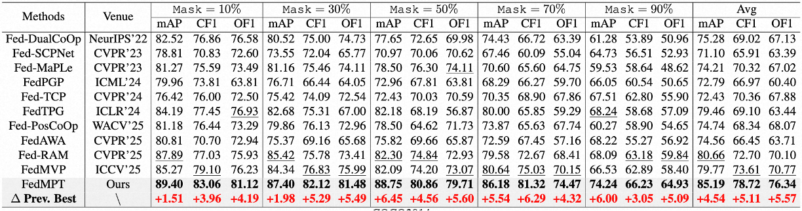

# 
 OpenFedML: Open Federated Learning for Multi-Label Tasks

<!-- [image]()
 -->

    <picture>
        <source media="(prefers-color-scheme: light)" srcset="doc/logo.png">
        
    </picture>

 
## Introduction
OpenFedML is the first open-source codebase for Federated Multi-Label Learning.
this respository also contains the code for CVPR 2026:  FedMPT: Federated Multi-Label Prompt Tuning of Vision-Language Models.

## Supported Methods
- DualCoOp [Dualcoop: Fast adaptation to multi-label recognition with limited annotations] [NeurlPS 2022]
- SCPNet [Exploring structured semantic prior for multi label recognition with incomplete labels] [NeurlPS 2022]
- MaPLE [Maple: Multi-modal prompt learning
] [CVPR 2023]
- FedTPG [Federated text-driven prompt generation for vision-language models] [ICLR 2024]
- RAM [Recover and match: Open-vocabulary multi-label recognition through knowledge-constrained optimal transport] [CVPR 2025]
- PosCoOp [Positivecoop: Rethinking prompting strategies for multi-label recognition with partial annotations] [WACV 2025]
- FedAWA [FedAWA: adaptive optimization of aggregation weights in federated learning using client vectors] [CVPR 2025]
- FedMVP [FedMVP: Federated Multimodal Visual Prompt Tuning for Vision-Language Models] [ICCV 2025]
- FedMPT [ours!] [FedMPT: Federated Multi-Label Prompt Tuning of Vision-Language Models] [CVPR 2026]

## Results 
We implement various existing baselines under the federated multi-label setting. the results are:

**On VOC 2007**

    <picture>
        <source media="(prefers-color-scheme: light)" srcset="doc/image1.png">
        
    </picture>

**On MSCOCO-2014**

    <picture>
        <source media="(prefers-color-scheme: light)" srcset="doc/image1.png">
        
    </picture>

**On NUS-WIDE**

    <picture>
        <source media="(prefers-color-scheme: light)" srcset="doc/image1.png">
        
    </picture>

## Run Experiments

run the code simply with:
``
bash run.sh
`` 
 

