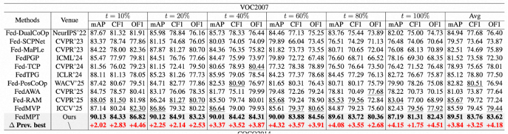
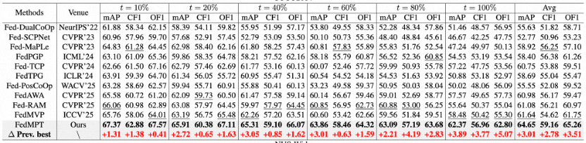
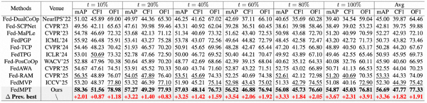

<div align="center">


[](https://github.com/xuc865/FedMPT-main)
<p align="center">
<a href="https://www.python.org/"></a>
<a href="https://pytorch.org/"></a>
</p>

</div>

---

## 📖 Introduction

**OpenFedML** is a unified codebase for **federated multi-label recognition (FMLR)** on CLIP-style VLMs. It bundles strong baselines and our method **FedMPT** (CVPR 2026): federated multi-label prompt tuning with condition-aware prompts under client heterogeneity.

## ⭐ FedMPT

FedMPT learns shared prompt tokens across clients, models multiple visual conditions, and fuses their predictions for robust multi-label classification. See the paper for full methodology.

## 🧩 Supported Methods

<p align="center"><sub>Select via <code>--model_name</code> · all methods share the same federated training loop</sub></p>

<table align="center">
<tr>
<th align="center">Method</th>
<th align="center">Paper</th>
<th align="center">Venue</th>
<th align="center"><code>--model_name</code></th>
</tr>
<tr>
<td align="center">DualCoOp</td>
<td align="center"><i>DualCoOp: Fast Adaptation to Multi-Label Recognition with Limited Annotations</i></td>
<td align="center">NeurIPS 2022</td>
<td align="center"><code>dualcoop</code></td>
</tr>
<tr>
<td align="center">SCPNet</td>
<td align="center"><i>Exploring Structured Semantic Prior for Multi Label Recognition with Incomplete Labels</i></td>
<td align="center">CVPR 2023</td>
<td align="center"><code>scpnet</code></td>
</tr>
<tr>
<td align="center">MaPLE</td>
<td align="center"><i>MaPLe: Multi-modal Prompt Learning</i></td>
<td align="center">CVPR 2023</td>
<td align="center"><code>maple</code></td>
</tr>
<tr>
<td align="center">TCP</td>
<td align="center"><i>TCP: Textual-based Class-aware Prompt Tuning for Visual-Language Model</i></td>
<td align="center">CVPR 2024</td>
<td align="center"><code>tcp</code></td>
</tr>
<tr>
<td align="center">FedTPG</td>
<td align="center"><i>Federated Text-driven Prompt Generation for Vision-Language Models</i></td>
<td align="center">ICLR 2024</td>
<td align="center"><code>fedtpg</code></td>
</tr>
<tr>
<td align="center">FedPGP</td>
<td align="center"><i>Harmonizing Generalization and Personalization in Federated Prompt Learning</i></td>
<td align="center">ICML 2024</td>
<td align="center"><code>fedpgp</code></td>
</tr>
<tr>
<td align="center">RAM / Fed-RAM</td>
<td align="center"><i>Recover and Match: Open-Vocabulary Multi-Label Recognition through Knowledge-Constrained Optimal Transport</i></td>
<td align="center">CVPR 2025</td>
<td align="center"><code>fedram</code></td>
</tr>
<tr>
<td align="center">PosCoOp</td>
<td align="center"><i>PositiveCoOp: Rethinking Prompting Strategies for Multi-Label Recognition with Partial Annotations</i></td>
<td align="center">WACV 2025</td>
<td align="center"><code>poscoop</code></td>
</tr>
<tr>
<td align="center">FedAWA</td>
<td align="center"><i>FedAWA: Adaptive Optimization of Aggregation Weights in Federated Learning Using Client Vectors</i></td>
<td align="center">CVPR 2025</td>
<td align="center"><code>fedawa</code></td>
</tr>
<tr>
<td align="center">FedMVP</td>
<td align="center"><i>FedMVP: Federated Multimodal Visual Prompt Tuning for Vision-Language Models</i></td>
<td align="center">ICCV 2025</td>
<td align="center"><code>fedmvp</code></td>
</tr>
<tr>
<td align="center"><b>FedMPT ⭐</b></td>
<td align="center"><b><i>FedMPT: Federated Multi-Label Prompt Tuning of Vision-Language Models</i></b></td>
<td align="center"><b>CVPR 2026</b></td>
<td align="center"><code>fedmpt</code></td>
</tr>
</table>

## 📊 Results

<p align="center"><sub>Federated multi-label recognition · mAP under client heterogeneity · click to expand</sub></p>

<table>
<tr>
<td align="center" width="100%">

<details open>
<summary><b>PASCAL VOC 2007</b></summary>
<br/>

</details>

</td>
</tr>
<tr>
<td align="center" width="100%">

<details>
<summary><b>MS COCO 2014</b></summary>
<br/>

</details>

</td>
</tr>
<tr>
<td align="center" width="100%">

<details>
<summary><b>NUS-WIDE</b></summary>
<br/>

</details>

</td>
</tr>
</table>

---

## 📦 Installation

**Requirements:** Python 3.8+, PyTorch (CUDA recommended), Linux or macOS.

```bash
git clone <repo-url> && cd FedMPT-main
bash setup.sh
```

`setup.sh` will:

1. 📥 Install `requirements.txt`
2. 🔤 Ensure CLIP BPE vocab in `clip/` and `convclip/`
3. 🖼️ Check CLIP ViT-B/16 weights at `~/.cache/clip/ViT-B-16.pt`

**Manual download** (if network is blocked):

| Asset | Link | Target |
|-------|------|--------|
| BPE vocab | [CLIP bpe_simple_vocab_16e6.txt.gz](https://raw.githubusercontent.com/openai/CLIP/main/clip/bpe_simple_vocab_16e6.txt.gz) | `convclip/bpe_simple_vocab_16e6.txt.gz` |
| ViT-B/16 weights | [ViT-B-16.pt](https://openaipublic.azureedge.net/clip/models/5806e77cd80f8b59890b7e101eabd078d9fb84e6937f9e85e4ecb61988df416f/ViT-B-16.pt) | `~/.cache/clip/ViT-B-16.pt` |

---

## 🗂️ Data Preparation

Set `DATA_ROOT` (default `./data`):

| Dataset | `--dataset` | Layout under `$DATA_ROOT` |
|---------|-------------|---------------------------|
| PASCAL VOC 2007 | `voc` | `VOC2007/VOCtrainval2007/VOCdevkit/VOC2007/`<br>`VOC2007/VOCtest2007/VOCdevkit/VOC2007/` |
| MS COCO 2014 | `coco` | `coco/train2014/`, `coco/val2014/`, `coco/annotations/` |
| NUS-WIDE | `nus` | `NUSWIDE/raw/Flickr/`, `NUSWIDE/ImageList/`, `NUSWIDE/TrainTestLabels/` |
| Multi-Scene | `multiscene` | `MultiScene-Clean/Tra.csv`, `Test.csv`, `images/*.jpg` |
| MLRSNet | `mlrsnet` | `MLRSNet/Labels/<category>.csv`, `MLRSNet/Images/<category>/` |

Official downloads: [VOC](http://host.robots.ox.ac.uk/pascal/VOC/voc2007/) · [COCO](https://cocodataset.org/) · [NUS-WIDE](https://lms.comp.nus.edu.sg/wp-content/uploads/2019/research/nuswide/NUS-WIDE.html) · [Multi-Scene](https://multiscene.github.io/) · [MLRSNet](https://github.com/summitgao/MLRSNet)

If any dataset link is unavailable, you can also obtain mirrors from [OpenDataLab](https://opendatalab.com/).

- **SCPNet** (optional): `python scripts/build_scpnet_relations.py --dataset <voc|coco|nus|multiscene|mlrsnet> --root $DATA_ROOT`
- **ZSL / GZSL**: put filtered JSONs in `labs/` — see `labs/README.md` (not needed for standard FMLR)

---

## 🚀 Run Experiments

### Quick start — `run.sh`

```bash
export DATA_ROOT=./data
export OUTPUT_DIR=./outputs

# bash run.sh <dataset>    <lr>     <model>    <epochs> <gpu> <num_clusters>
bash run.sh voc            0.001    fedmpt     50       0     2
bash run.sh coco           0.001    fedmpt     100      0     8
bash run.sh nus            0.001    dualcoop   50       0     4
bash run.sh multiscene     0.001    fedmpt     50       0     2
bash run.sh mlrsnet        0.001    fedmpt     50       0     4
```

| # | Argument | Description |
|---|----------|-------------|
| 1 | `dataset` | `voc` · `coco` · `nus` · `multiscene` · `mlrsnet` |
| 2 | `lr` | Client learning rate |
| 3 | `model` | e.g. `fedmpt`, `dualcoop`, `fedmvp`, `fedram` |
| 4 | `epochs` | Federated rounds |
| 5 | `gpu` | `CUDA_VISIBLE_DEVICES` |
| 6 | `num_clusters` | Client partitions (heterogeneity) |

Outputs: `$OUTPUT_DIR/<exp_name>/<model>/...`

### Full control — `Launch_FL.py`

```bash
python Launch_FL.py \
  --root ./data \
  --output-dir ./outputs \
  --dataset voc \
  --model_name fedmpt \
  --exp_name cross_cls \
  --num_epoch 50 \
  --lr 0.001 \
  --batch_size 32 \
  --num_clusters 2 \
  --num_cls_per_client 1 \
  --avail_percent 1.0 \
  --cond 5 --cls 4 --temp 4 \
  --seed 34
```

| Flag | Description |
|------|-------------|
| `--model_name` | Method selector |
| `--num_clusters` | Number of client clusters |
| `--num_cls_per_client` | Classes per client |
| `--avail_percent` | Fraction of clients sampled per round |
| `--pa` | Partial annotation rate |
| `--eval-only` | Evaluation only |
| `--model-dir` / `--load-epoch` | Checkpoint for eval |

**Eval example**

```bash
python Launch_FL.py \
  --root ./data --output-dir ./outputs \
  --dataset voc --model_name fedmpt \
  --eval-only \
  --model-dir ./outputs/cross_cls/fedmpt/... \
  --load-epoch 50
```

**Remote sensing (Multi-Scene & MLRSNet)**

```bash
python Launch_FL.py --root ./data --output-dir ./outputs \
  --dataset multiscene --model_name fedmpt --num_epoch 50 --num_clusters 2

python Launch_FL.py --root ./data --output-dir ./outputs \
  --dataset mlrsnet --model_name fedmpt --num_epoch 50 --num_clusters 4
```

---

## 🏗️ Federated Framework

<p align="center">

```
Launch_FL.py  →  Server(cfg).train()
                 ├─ build clients (class / cluster split)
                 ├─ each round: sample clients → local train → FedAvg
                 └─ periodic test (mAP / F1)
```

</p>

<p align="center"><sub><code>fedmpt</code> shares the prompt-learner FedAvg path with <code>dualcoop</code>, <code>fedmvp</code>, <code>fedtpg</code>, … · <code>fedram</code> / <code>fedawa</code> use dedicated server branches</sub></p>

---

## 📄 Citation

If you use OpenFedML or FedMPT, please cite our paper (bibtex to be added).
